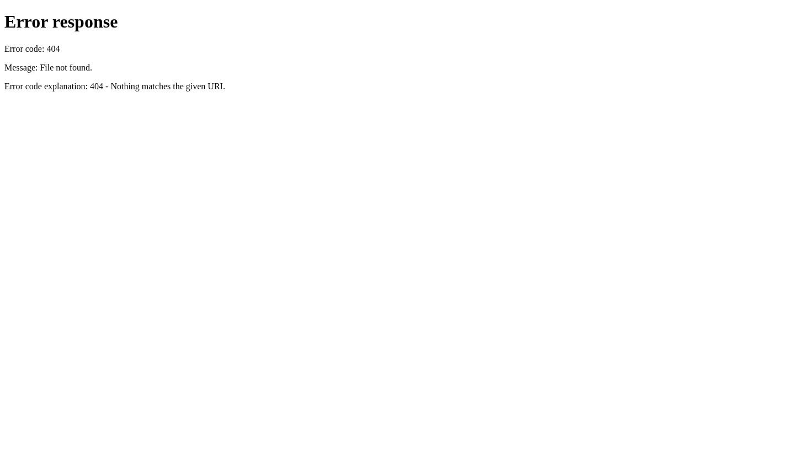

# Railmate 🚄

A premium train tracking app built with React Native and Expo, inspired by Flighty. Track your Deutsche Bahn journeys with real-time updates, beautiful animations, and a sleek dark interface.


## Features ✨

### Core Features
- 🔍 **Search & Track** - Find journeys between any German stations
- 📍 **Live Map** - Visualize your train's current position on the route
- 🚉 **Station Board** - Airport-style departure board with real-time updates
- 📊 **Journey Timeline** - See all stops with arrival/departure times
- 🔔 **Live Activities** - iOS Lock Screen tracking (iOS 16.1+)
- 📱 **Cross-Platform** - iOS and Android support

### Premium Design
- 🎨 **Flighty-Inspired UI** - Beautiful dark theme with smooth animations
- ⚡ **Smooth Animations** - 60fps transitions and micro-interactions
- 🎯 **Real-Time Updates** - Live progress tracking and status changes
- 📈 **Statistics** - Travel stats, achievements, and favorite routes

## Tech Stack 🛠

- **Framework**: React Native 0.73+ with Expo SDK 50
- **Navigation**: Expo Router (file-based)
- **Styling**: NativeWind (Tailwind for RN)
- **State**: Zustand + React Query
- **Maps**: React Native Maps
- **Animations**: React Native Reanimated
- **Icons**: Ionicons

## Screenshots 📸

### My Trains (Home Screen)


| Home | Map | Station Board |
|------|-----|---------------|
| My Trains list | Live route map | Departure board |

| Journey Detail | Search | Passport |
|----------------|--------|----------|
| Timeline view | Station search | Stats & achievements |

## Getting Started 🚀

### Prerequisites
- Node.js 18+
- npm or yarn
- Expo CLI (optional)
- iOS Simulator (Mac) or Android Emulator

### Installation

1. Clone the repository
```bash
git clone <repo-url>
cd railmate/apps/mobile
```

2. Install dependencies
```bash
npm install
```

3. Start the development server
```bash
npx expo start
```

4. Run on your device
- iOS: Press `i` or scan QR with Camera app
- Android: Press `a` or scan QR with Expo Go

## Building for Production 📦

### Using EAS Build (Recommended)

```bash
# Install EAS CLI
npm install -g eas-cli

# Login to Expo
eas login

# Configure build
eas build:configure

# Build for iOS
eas build --platform ios

# Build for Android
eas build --platform android
```

### Local Build (Advanced)

```bash
# Generate native projects
npx expo prebuild

# iOS
cd ios && pod install && cd ..
npx expo run:ios

# Android
npx expo run:android
```

## API 🌐

Railmate uses the Deutsche Bahn API via:
- **Base URL**: `https://v5.db.transport.rest`
- **Documentation**: [db-rest API docs](https://v5.db.transport.rest/)

No API key required!

## Project Structure 📁

```
railmate/apps/mobile/
├── src/
│   ├── app/                 # Expo Router screens
│   │   ├── (tabs)/         # Tab navigation screens
│   │   ├── journey/[id].tsx # Journey detail screen
│   │   └── search.tsx      # Search screen
│   ├── components/         # Reusable UI components
│   ├── hooks/              # Custom React hooks
│   ├── lib/                # Utilities & API
│   └── stores/             # Zustand state stores
├── assets/                 # Images, fonts, icons
└── app.json               # Expo configuration
```

## Features in Detail 🔍

### My Trains (Home)
- View all tracked journeys
- Grouped by: Active, Today, Upcoming, Past
- Pull-to-refresh for updates
- Beautiful animated cards

### Live Map
- See train position on route
- Animated map markers
- Multiple journey selector
- Dark map style

### Station Board
- Airport FIDS-style display
- Real-time departures
- Search any German station
- Status indicators (On Time, Delayed, Cancelled)

### Journey Detail
- Complete stop timeline
- Live progress tracking
- Platform information
- iOS Live Activity support

### Passport
- Travel statistics
- Achievement system with progress bars
- Favorite routes
- Level progression

## Customization 🎨

### Colors
Edit `src/lib/constants.ts`:
```typescript
export const COLORS = {
  background: '#000000',
  card: '#1C1C1E',
  primary: '#007AFF',
  success: '#34C759',
  warning: '#FF9500',
  danger: '#FF3B30',
  // ...
};
```

### API
To use a different train API, modify `src/lib/api.ts`.

## Troubleshooting 🔧

### Build Issues
- **Gradle errors**: Ensure Java 17+ is installed
- **iOS build fails**: Run `cd ios && pod install`
- **Android build fails**: Clean with `cd android && ./gradlew clean`

### Runtime Issues
- **API not working**: Check internet connection
- **Maps not showing**: Ensure API key is configured
- **Location not working**: Grant location permissions

## Contributing 🤝

1. Fork the repository
2. Create your feature branch (`git checkout -b feature/amazing-feature`)
3. Commit your changes (`git commit -m 'Add amazing feature'`)
4. Push to the branch (`git push origin feature/amazing-feature`)
5. Open a Pull Request

## License 📄

MIT License - see LICENSE file for details

## Acknowledgments 🙏

- Design inspired by [Flighty](https://flightyapp.com/)
- Deutsche Bahn API by [db-rest](https://github.com/public-transport/db-rest)
- Built with [Expo](https://expo.dev/) and [React Native](https://reactnative.dev/)

---

Made with ❤️ for train enthusiasts
